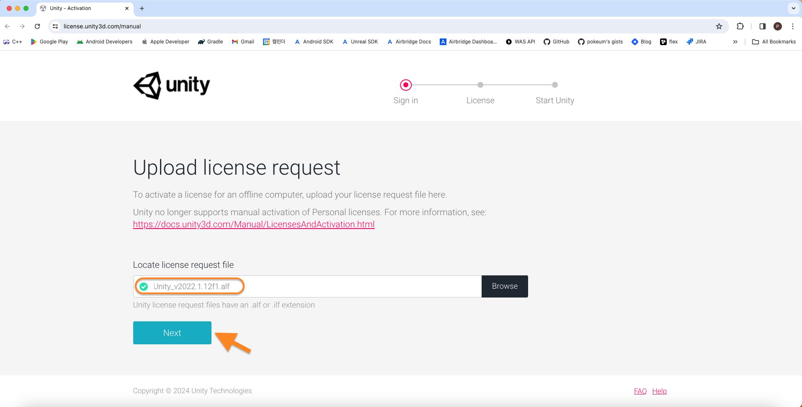
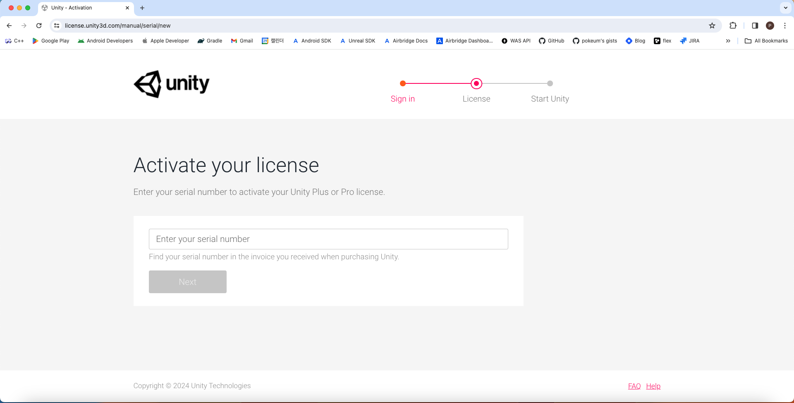
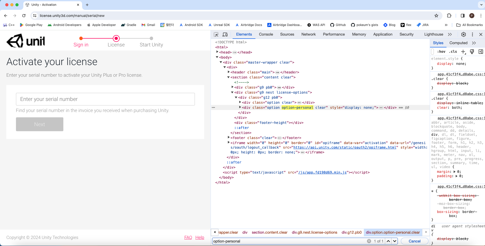
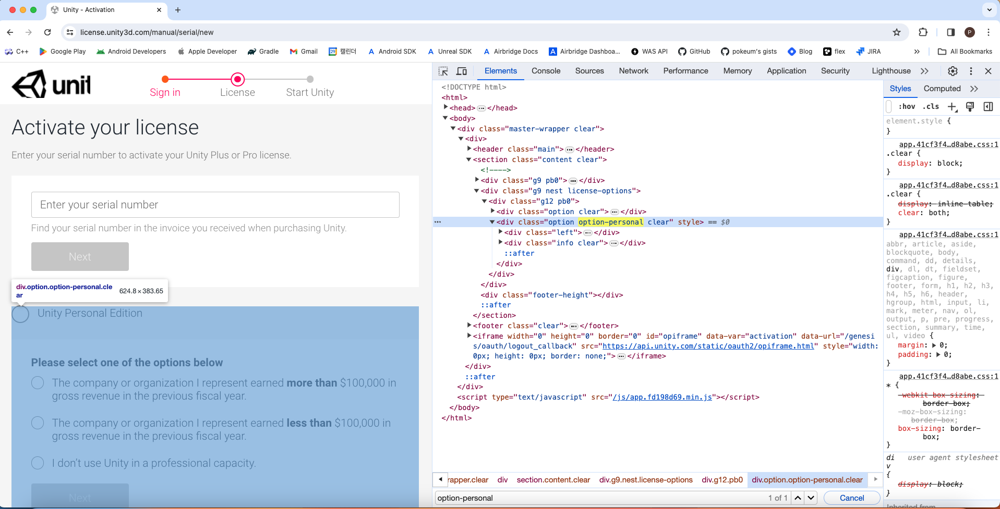
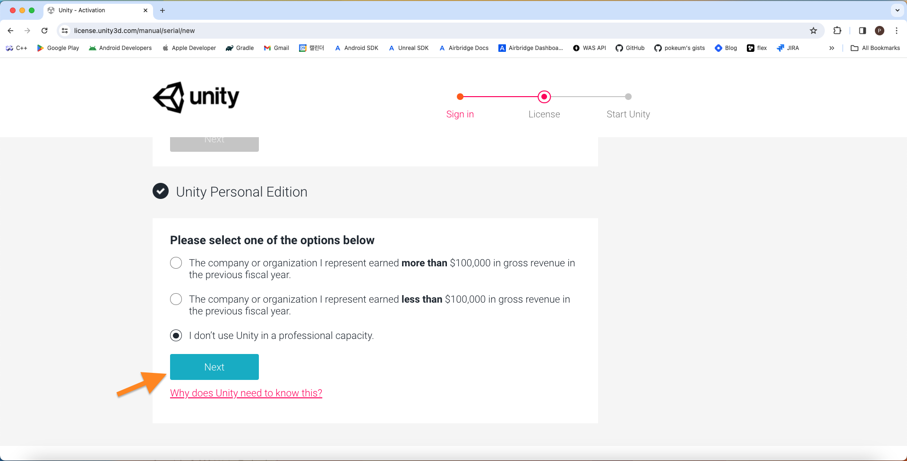
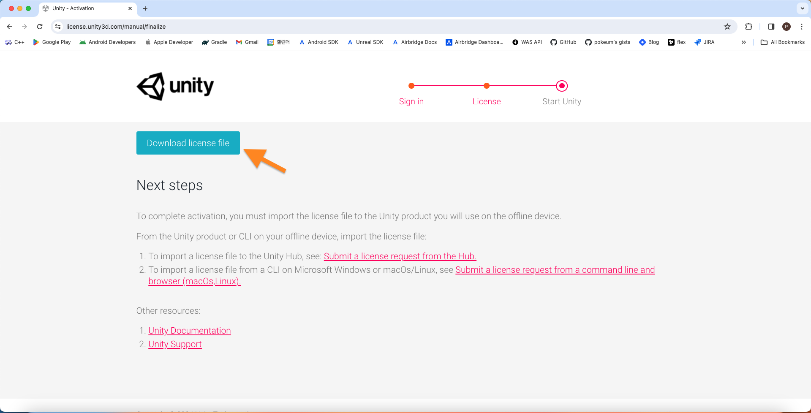

# Generate a Unity license file

Go to [Manual activation page](https://license.unity3d.com/manual)

## Upload license request
   

## Activate your license

> [!TIP]
>
> Use the Chrome inspect : `⌘` (Command) + `⌥` (Option) + `C` 
>
> 1. Find `option-personal` from Elements 
> 
> 2. Change `style="display: none;"` to `style=""` 

    
   

## Download license file

