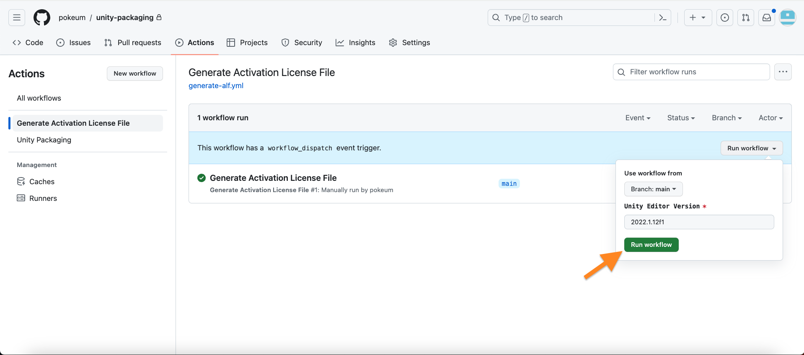
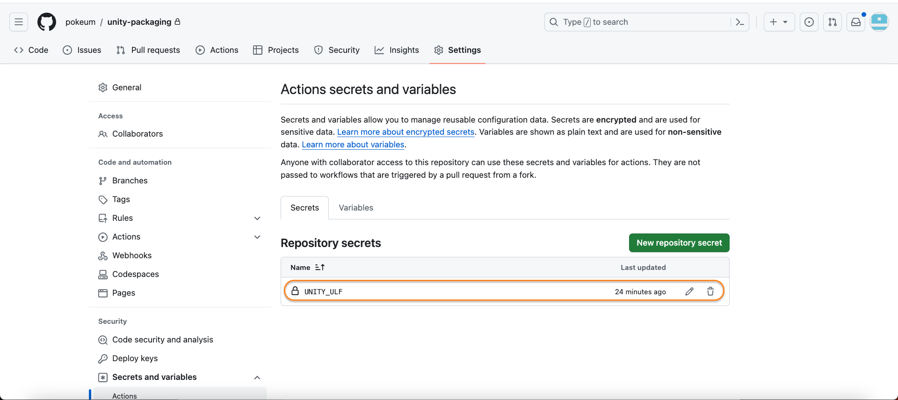
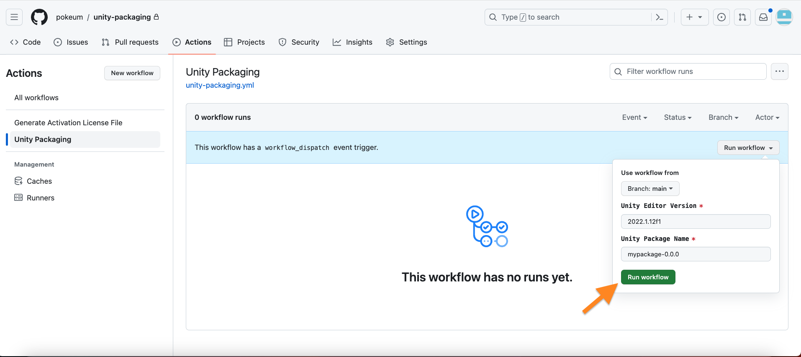

# Apply automation to your project

1. Copy the files in the `.github/workflows` folder to your repository
2. Run _Generate Activation License File_ workflow to create a license request file (.alf)

    

3. Use that .alf file to generate a Unity license file (.ulf) from Unity

    [Generate a Unity license file](./generate-ulf.md)

4. Encode a download license file and save it to a repository's secrets (`UNITY_ULF`)

    ```bash
    base64 < /Users/pokeum/Downloads/Unity_v2022.x.ulf | pbcopy
    ```

    

5. Specify which assets should be included in a Unity Package (.unitypackage) using `.unitypackage_exports` file

    ```
    # Include Script
    Assets/MyPackage/Include

    # Include Scene
    Assets/Scenes/IncludeScene.unity
    ```
   
6. Customize and use the `unity-packaging.yml` file to fit your project environment

    ```
    your-repository-name --> Unity project root
        ├── .github
        |      └── workflows
        ├── Assets
        |      ├── Scenes
        |      ├── Scripts
        |      ├── ...
        ├── .unitypackage_exports
        ├── ...
    ```

    If the root folder of your GitHub repository and the root folder of your Unity project are the same,    
    change the unity-packaging.yml file as shown below:
    ```yaml    
    jobs:
      unity-packaging:
        ...
    
        env:
          ...
      
          UNITY_PROJECT_PATH: ${{ '.' }}
    ```
    
7. Run _Unity Packaging_ workflow to create unity package
   
    > You can customize your Git workflow to ensure that a merge event triggers the release stage and automatically run unity packaging workflow

    

    → Download artifact and unzip it

    ```bash
    unzip /Users/pokeum/Downloads/mypackage-0.0.0.zip
    ```
